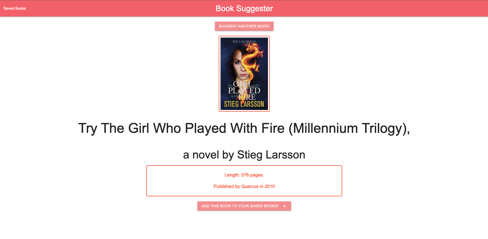
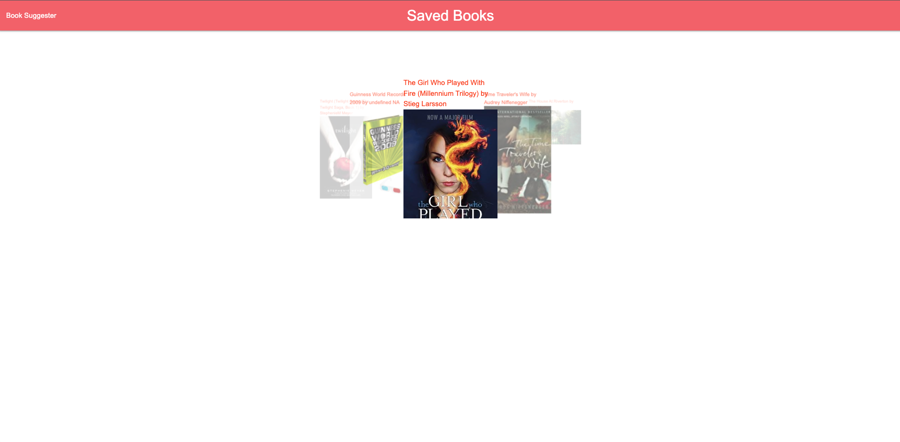

# Book Suggester

## Description
I created an application that suggests a random book to you based on [this list](https://www.theguardian.com/news/datablog/2011/jan/01/top-100-books-of-all-time#data).

### User Story
AS a reader,  
I WANT an application that suggests random books  
SO THAT I can have something new to read  
### Acceptance Criteria
WHEN I load the page,  
THEN I am presented with a button to randomly generate a book and a link to my saved books  
WHEN I click the random generate button,  
THEN I am presented with a book’s cover, title, author, date published, and a button to save the book to my saved list  
WHEN I click the save button,  
THEN the book’s information is saved in localStorage  
WHEN I click the saved books link,  
THEN I am redirected to another page  
WHEN I am redirected to the other page,  
THEN I am presented with a carousel that holds the covers of all my saved books and their info

## Technologies Used
Web API: ISBNDB: The World’s largest book database™  
CSS Framework: materialize  
Carousel: materialize  
GoogleAPIs: fonts; for shuffle and add symbols

## Preview of application
The following is a screenshot of a randomized novel:

The following is a screenshot of saved books:

## Location of deployed application
[Here](https://jmcavaddy.github.io/book-suggester/index.html) is where you can find a new book today!